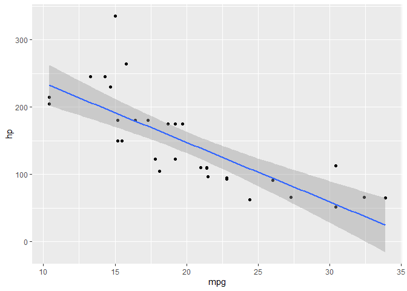

<!-- README.md is generated from README.Rmd. Please edit that file -->

# {ggtrace}

<!-- badges: start -->
<!-- badges: end -->

An experimental package for programmatically debugging ggproto methods
with `trace()`.

## Installation

You can install the development version from
[GitHub](https://github.com/) with:

``` r
# install.packages("devtools")
devtools::install_github("yjunechoe/ggtrace")
```

## Usage

``` r
library(ggtrace)
library(ggplot2) # v3.3.5
#> Warning: package 'ggplot2' was built under R version 4.1.1
```

### Example 1 - PositionJitter$compute\_layer {ggplot2}

``` r
jitter_plot <- ggplot(diamonds[1:1000,], aes(cut, depth)) +
  geom_point(position = position_jitter(width = 0.2, seed = 2021))
jitter_plot
```


``` r
ggbody(PositionJitter$compute_layer)
#> [[1]]
#> `{`
#> 
#> [[2]]
#> trans_x <- if (params$width > 0) function(x) jitter(x, amount = params$width)
#> 
#> [[3]]
#> trans_y <- if (params$height > 0) function(x) jitter(x, amount = params$height)
#> 
#> [[4]]
#> x_aes <- intersect(ggplot_global$x_aes, names(data))
#> 
#> [[5]]
#> x <- if (length(x_aes) == 0) 0 else data[[x_aes[1]]]
#> 
#> [[6]]
#> y_aes <- intersect(ggplot_global$y_aes, names(data))
#> 
#> [[7]]
#> y <- if (length(y_aes) == 0) 0 else data[[y_aes[1]]]
#> 
#> [[8]]
#> dummy_data <- new_data_frame(list(x = x, y = y), nrow(data))
#> 
#> [[9]]
#> fixed_jitter <- with_seed_null(params$seed, transform_position(dummy_data, 
#>     trans_x, trans_y))
#> 
#> [[10]]
#> x_jit <- fixed_jitter$x - x
#> 
#> [[11]]
#> y_jit <- fixed_jitter$y - y
#> 
#> [[12]]
#> transform_position(data, function(x) x + x_jit, function(x) x + 
#>     y_jit)
```

``` r
ggtrace(
  method = PositionJitter$compute_layer,
  trace_steps = c(1, 1, 8, 12),
  trace_exprs = rlang::exprs(
    head(data),   # What does the data passed in look like?
    params,       # What do the initial parameters look like?
    head(~line),  # What is this `dummy_data` thing on Step 8?
    head(~line)   # What does the last line evaluate to?
                  # - i.e., what is returned by the method?
  )
)
jitter_plot # plot not printed to save space
#> Tracing method compute_layer from <PstnJttr> ggproto.
#> 
#>  [Step 1]> head(data) 
#>   x    y PANEL group
#> 1 5 61.5     1     5
#> 2 4 59.8     1     4
#> 3 2 56.9     1     2
#> 4 4 62.4     1     4
#> 5 2 63.3     1     2
#> 6 3 62.8     1     3
#> 
#>  [Step 1]> params 
#> $width
#> [1] 0.2
#> 
#> $height
#> [1] 0.04
#> 
#> $seed
#> [1] 2021
#> 
#> 
#>  [Step 8]> head(~line) 
#>   x    y
#> 1 5 61.5
#> 2 4 59.8
#> 3 2 56.9
#> 4 4 62.4
#> 5 2 63.3
#> 6 3 62.8
#> 
#>  [Step 12]> head(~line) 
#>          x        y PANEL group
#> 1 4.980507 61.50684     1     5
#> 2 4.113512 59.77872     1     4
#> 3 2.083873 56.86655     1     2
#> 4 3.952698 62.42703     1     4
#> 5 2.054530 63.29763     1     2
#> 6 3.080538 62.77536     1     3
#> 
#> Untracing method compute_layer from <PstnJttr> ggproto.
#> Call `last_ggtrace()` to get the trace dump.
```

### Example 2 - StatSina$compute\_panel {ggforce}

``` r
library(ggforce)
#> Warning: package 'ggforce' was built under R version 4.1.1

sina_plot <- ggplot(diamonds[diamonds$cut == "Good",][1:25,], aes(cut, depth)) +
  geom_violin() +
  geom_sina(seed = 2021)
sina_plot
```


``` r
ggbody(StatSina$compute_panel)
#> [[1]]
#> `{`
#> 
#> [[2]]
#> if (!is.null(binwidth)) {
#>     bins <- bin_breaks_width(scales$y$dimension() + 1e-08, binwidth)
#> } else {
#>     bins <- bin_breaks_bins(scales$y$dimension() + 1e-08, bins)
#> }
#> 
#> [[3]]
#> data <- ggproto_parent(Stat, self)$compute_panel(data, scales, 
#>     scale = scale, method = method, bw = bw, kernel = kernel, 
#>     bins = bins$breaks, maxwidth = maxwidth, adjust = adjust, 
#>     bin_limit = bin_limit)
#> 
#> [[4]]
#> if (is.logical(scale)) {
#>     scale <- if (scale) 
#>         "area"
#>     else "width"
#> }
#> 
#> [[5]]
#> data$sinawidth <- switch(scale, area = data$density/max(data$density), 
#>     count = data$density/max(data$density) * data$n/max(data$n), 
#>     width = data$scaled)
#> 
#> [[6]]
#> if (!is.na(seed)) {
#>     new_seed <- sample(.Machine$integer.max, 1L)
#>     set.seed(seed)
#>     on.exit(set.seed(new_seed))
#> }
#> 
#> [[7]]
#> data$xmin <- data$x - maxwidth/2
#> 
#> [[8]]
#> data$xmax <- data$x + maxwidth/2
#> 
#> [[9]]
#> data$x_diff <- runif(nrow(data), min = -1, max = 1) * maxwidth * 
#>     data$sinawidth/2
#> 
#> [[10]]
#> data$width <- maxwidth
#> 
#> [[11]]
#> if (all(data$y == floor(data$y))) {
#>     data$y <- jitter(data$y)
#> }
#> 
#> [[12]]
#> data
```

``` r
ggtrace(
  method = "compute_panel",
  obj = StatSina,
  trace_steps = c(1, 12),
  trace_exprs = rlang::expr(data), # evaluated at Step 1 and Step 12
  .print = FALSE
)
sina_plot # plot not printed to save space
```



    #> Tracing method compute_panel from <StatSina> ggproto.
    #> 
    #>  [Step 1]> data 
    #> 
    #>  [Step 12]> data

    # Sometimes doesn't automatically untrace so this may be required
    untrace("compute_panel", where = StatSina)
    #> Untracing function "compute_panel" in package ".GlobalEnv"

``` r
last_ggtrace()
#> $`[Step 1]> data`
#>    x    y PANEL group
#> 1  1 56.9     1     1
#> 2  1 63.3     1     1
#> 3  1 64.0     1     1
#> 4  1 63.4     1     1
#> 5  1 63.8     1     1
#> 6  1 63.3     1     1
#> 7  1 58.2     1     1
#> 8  1 64.1     1     1
#> 9  1 64.0     1     1
#> 10 1 65.2     1     1
#> 11 1 58.4     1     1
#> 12 1 63.1     1     1
#> 13 1 63.8     1     1
#> 14 1 63.2     1     1
#> 15 1 63.7     1     1
#> 16 1 57.9     1     1
#> 17 1 57.5     1     1
#> 18 1 59.4     1     1
#> 19 1 62.1     1     1
#> 20 1 59.2     1     1
#> 21 1 64.6     1     1
#> 22 1 59.7     1     1
#> 23 1 63.8     1     1
#> 24 1 57.8     1     1
#> 25 1 64.1     1     1
#> 
#> $`[Step 12]> data`
#>    x    y PANEL group    density    scaled width  n sinawidth xmin xmax
#> 1  1 56.9     1     1 0.06161965 0.3497890   0.9 25 0.3498232 0.55 1.45
#> 2  1 63.3     1     1 0.16892697 0.9589278   0.9 25 0.9590217 0.55 1.45
#> 3  1 64.0     1     1 0.17293663 0.9816890   0.9 25 0.9817851 0.55 1.45
#> 4  1 63.4     1     1 0.17190008 0.9758049   0.9 25 0.9759004 0.55 1.45
#> 5  1 63.8     1     1 0.17590431 0.9985352   0.9 25 0.9986329 0.55 1.45
#> 6  1 63.3     1     1 0.16892697 0.9589278   0.9 25 0.9590217 0.55 1.45
#> 7  1 58.2     1     1 0.08982467 0.5098971   0.9 25 0.5099470 0.55 1.45
#> 8  1 64.1     1     1 0.17023630 0.9663603   0.9 25 0.9664549 0.55 1.45
#> 9  1 64.0     1     1 0.17293663 0.9816890   0.9 25 0.9817851 0.55 1.45
#> 10 1 65.2     1     1 0.10449007 0.5931464   0.9 25 0.5932045 0.55 1.45
#> 11 1 58.4     1     1 0.08989340 0.5102873   0.9 25 0.5103372 0.55 1.45
#> 12 1 63.1     1     1 0.16086940 0.9131884   0.9 25 0.9132777 0.55 1.45
#> 13 1 63.8     1     1 0.17590431 0.9985352   0.9 25 0.9986329 0.55 1.45
#> 14 1 63.2     1     1 0.16522038 0.9378870   0.9 25 0.9379788 0.55 1.45
#> 15 1 63.7     1     1 0.17614511 0.9999022   0.9 25 1.0000000 0.55 1.45
#> 16 1 57.9     1     1 0.08730852 0.4956140   0.9 25 0.4956625 0.55 1.45
#> 17 1 57.5     1     1 0.07970482 0.4524509   0.9 25 0.4524952 0.55 1.45
#> 18 1 59.4     1     1 0.07423288 0.4213890   0.9 25 0.4214303 0.55 1.45
#> 19 1 62.1     1     1 0.09876785 0.5606638   0.9 25 0.5607186 0.55 1.45
#> 20 1 59.2     1     1 0.07891770 0.4479828   0.9 25 0.4480266 0.55 1.45
#> 21 1 64.6     1     1 0.14645910 0.8313871   0.9 25 0.8314685 0.55 1.45
#> 22 1 59.7     1     1 0.06677863 0.3790744   0.9 25 0.3791115 0.55 1.45
#> 23 1 63.8     1     1 0.17590431 0.9985352   0.9 25 0.9986329 0.55 1.45
#> 24 1 57.8     1     1 0.08583966 0.4872759   0.9 25 0.4873236 0.55 1.45
#> 25 1 64.1     1     1 0.17023630 0.9663603   0.9 25 0.9664549 0.55 1.45
#>         x_diff
#> 1  -0.01534303
#> 2   0.24493587
#> 3   0.18527659
#> 4  -0.10386524
#> 5   0.12252367
#> 6   0.17378568
#> 7   0.06445477
#> 8  -0.20294417
#> 9   0.27870853
#> 10  0.25785897
#> 11 -0.21712788
#> 12  0.27740022
#> 13  0.09278963
#> 14  0.05694285
#> 15  0.28804753
#> 16 -0.11082312
#> 17  0.00223742
#> 18  0.13940252
#> 19  0.23121986
#> 20  0.01842641
#> 21 -0.26970952
#> 22  0.15536192
#> 23 -0.09662331
#> 24 -0.10154036
#> 25  0.06280618
```
