<!-- README.md is generated from README.Rmd. Please edit that file -->

# **{ggtrace}** 

<!-- badges: start -->

[](https://github.com/yjunechoe/ggtrace)
[](https://github.com/yjunechoe/ggtrace/actions/workflows/R-CMD-check.yaml)
[](https://app.codecov.io/gh/yjunechoe/ggtrace?branch=main)
<!-- badges: end -->

#### **Programmatically explore, debug, and manipulate ggplot internals**

### **Installation**

You can install the development version from
[GitHub](https://github.com/yjunechoe/ggtrace/) with:

    # install.packages("remotes")
    remotes::install_github("yjunechoe/ggtrace")

    library(ggtrace)

More on the 📦 package website: <https://yjunechoe.github.io/ggtrace>

### **Description**

`{ggtrace}` embodies an opinionated approach to
learning/debugging/hacking `{ggplot2}` internals. I recommend watching
the following presentation(s) on `{ggtrace}` before getting started on
any kind of code:

-   [Talk at
    rstudio::conf(2022)](https://github.com/yjunechoe/ggtrace-rstudioconf2022).

-   [Talk at useR!
    2022](https://www.youtube.com/watch?v=2JX8zu4QxMg&t=2959s) (+
    accompanying
    [materials](https://github.com/yjunechoe/ggtrace-user2022)).

You can read the full philosophy behind `{ggtrace}` in the [Getting
Started](https://yjunechoe.github.io/ggtrace/articles/getting-started.html)
vignette. But broadly speaking, `{ggtrace}` was designed with **three
goals** in mind, in order of increasing complexity:

1.  To help users understand the design of **sublayer modularity**,
    allowing them to write more expressive layer code using [delayed
    aesthetic
    evaluation](https://ggplot2.tidyverse.org/reference/aes_eval.html)
    functions. This is a primarily pedagogical goal and outlined in my
    paper [Sub-layer modularity in the Grammar of
    Graphics](https://yjunechoe.github.io/static/papers/Choe_2022_SublayerGG.pdf).
    The family of `layer_*()` extractor functions return snapshots of
    layer data in the internals, to help develop an accessible mental
    model of sublayer processes as a data wrangling pipeline.

    

2.  To facilitate the **user-developer transition**, empowering
    experienced users of `{ggplot2}` to start developing their own
    extension packages. This is achieved via a family of `inspect`,
    `capture`, and `highjack` workflow functions, which provide a
    functional interface into the object-oriented design of the
    internals (the `<ggproto>` OOP).

    

3.  To provide a **pseudo-extension mechanism** for `{ggplot2}`, by
    injecting custom code to hack into the rendering pipeline. This is
    similar in spirit to
    [`{gggrid}`](https://www.stat.auckland.ac.nz/~paul/Reports/gggrid/gggrid.html)
    and [`{gginnards}`](https://github.com/aphalo/gginnards), but with a
    broader scope (targeting any arbitrary computation) at the cost of
    reproducibility (may break with even trivial changes to the
    `{ggplot2}` codebase). This is achieved via the low-level function
    `ggtrace()` (extending the capabilities of `base::trace()`) and its
    functional form `with_ggtrace()`. See examples in the
    [Overview](https://yjunechoe.github.io/ggtrace/articles/overview.html)
    vignette.

## **Example usage**

    library(ggplot2)
    packageVersion("ggplot2")
    #> [1] '3.4.2'

### 1) **Inspect sub-layer data**

> Example adopted from [Demystifying delayed aesthetic
> evaluation](https://yjunechoe.github.io/posts/2022-03-10-ggplot2-delayed-aes-1/)

A bar plot of counts with `geom_bar()` with `stat = "count"` default:

    bar_plot <- ggplot(mpg, aes(class, fill = class)) +
      geom_bar() +
      theme(legend.position = "none")

State of bar layer’s data after the statistical transformation step:

    ggtrace::layer_after_stat(bar_plot)
    #> ✔ Executed `ggtrace_inspect_return(bar_plot, ggplot2:::Layer$compute_statistic)`
    #> # A tibble: 7 × 8
    #>   count  prop x          width flipped_aes fill       PANEL group
    #>   <dbl> <dbl> <mppd_dsc> <dbl> <lgl>       <chr>      <fct> <int>
    #> 1     5     1 1            0.9 FALSE       2seater    1         1
    #> 2    47     1 2            0.9 FALSE       compact    1         2
    #> 3    41     1 3            0.9 FALSE       midsize    1         3
    #> 4    11     1 4            0.9 FALSE       minivan    1         4
    #> 5    33     1 5            0.9 FALSE       pickup     1         5
    #> 6    35     1 6            0.9 FALSE       subcompact 1         6
    #> 7    62     1 7            0.9 FALSE       suv        1         7

We can map aesthetics to variables from the after-stat data using
`after_stat()`:

    bar_plot +
      geom_text(
        aes(label = after_stat(count)),
        stat = "count",
        position = position_nudge(y = 1), vjust = 0
      )

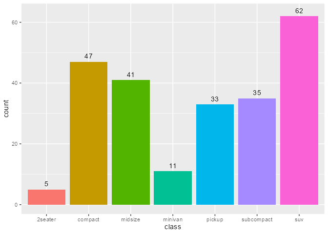

Same idea with `after_scale()`:

    scatter_plot <- ggplot(mpg, aes(displ, hwy, fill = class)) +
      scale_fill_viridis_d(option = "magma")
    scatter_plot +
      geom_point(shape = 21, size = 4, stroke = 1)

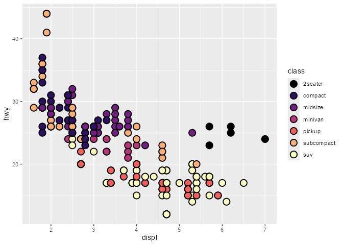

    # `fill` column available for `after_scale(fill)`
    ggtrace::layer_after_scale(scatter_plot)
    #> ✔ Executed `ggtrace_inspect_return(scatter_plot, ggplot2:::Layer$compute_geom_2)`
    #> # A tibble: 234 × 5
    #>    fill          x     y PANEL group
    #>    <chr>     <dbl> <dbl> <fct> <int>
    #>  1 #2D1160FF   1.8    29 1         2
    #>  2 #2D1160FF   1.8    29 1         2
    #>  3 #2D1160FF   2      31 1         2
    #>  4 #2D1160FF   2      30 1         2
    #>  5 #2D1160FF   2.8    26 1         2
    #>  6 #2D1160FF   2.8    26 1         2
    #>  7 #2D1160FF   3.1    27 1         2
    #>  8 #2D1160FF   1.8    26 1         2
    #>  9 #2D1160FF   1.8    25 1         2
    #> 10 #2D1160FF   2      28 1         2
    #> # ℹ 224 more rows

    scatter_plot +
      geom_point(
        aes(color = after_scale(prismatic::best_contrast(fill))),
        shape = 21, size = 4, stroke = 1
      )

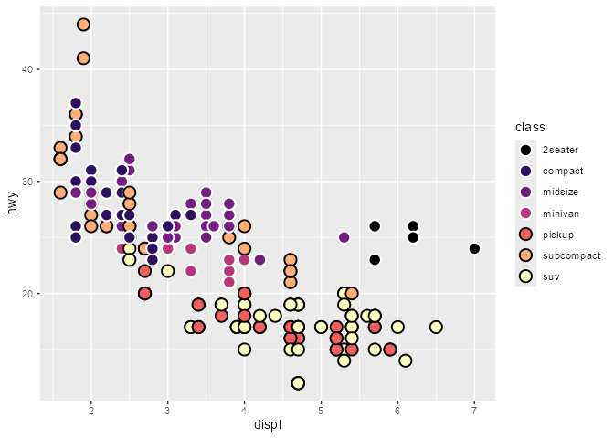

### 2) **Debug sublayer data**

> Example adopted from my [rstudio::conf 2022
> talk](https://github.com/yjunechoe/ggtrace-rstudioconf2022)

Given a boxplot made with a `geom_boxplot()` layer, suppose that we want
to add a second layer annotating the value of the upper whiskers:

    box_p <- ggplot(data = mtcars) +
      aes(x = factor(cyl), y = mpg) +
      geom_boxplot()
    box_p

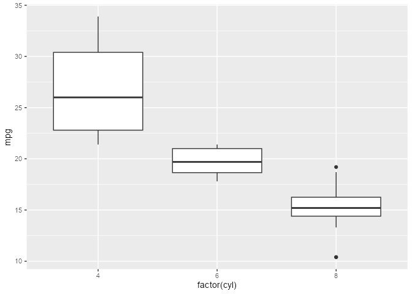

A naive approach would be to add a layer that combines a **boxplot**
stat with a **label** geom. But this errors out of the box:

    box_p +
      geom_label(stat = "boxplot")
    #> Error in `geom_label()`:
    #> ! Problem while setting up geom.
    #> ℹ Error occurred in the 2nd layer.
    #> Caused by error in `compute_geom_1()`:
    #> ! `geom_label()` requires the following missing aesthetics: y and label

The error tells us that the geom is missing some missing aesthetics, so
something must be wrong with **the data that the geom receives**. If we
inspect this using `layer_before_geom()`, we find that the columns for
`y` and `label` are indeed missing in the *Before Geom* data:

    layer_before_geom(last_plot(), layer = 2L, error = TRUE, verbose = FALSE)
    #> # A tibble: 3 × 14
    #>    ymin lower middle upper  ymax outliers  notchupper notchlower     x width
    #>   <dbl> <dbl>  <dbl> <dbl> <dbl> <list>         <dbl>      <dbl> <dbl> <dbl>
    #> 1  21.4  22.8   26    30.4  33.9 <dbl [0]>       29.6       22.4     1  0.75
    #> 2  17.8  18.6   19.7  21    21.4 <dbl [0]>       21.1       18.3     2  0.75
    #> 3  13.3  14.4   15.2  16.2  18.7 <dbl [3]>       16.0       14.4     3  0.75
    #> # ℹ 4 more variables: relvarwidth <dbl>, flipped_aes <lgl>, PANEL <fct>,
    #> #   group <int>

Thus, we need to ensure that `y` exists to satisfy both the stat and the
geom, and that `label` exists after the statistical transformation step
but before the geom sees the data. Crucially, we use the computed
variable `ymax` to (re-)map to the `y` and `label` aesthetics.

    box_p +
      geom_label(
        aes(y = stage(mpg, after_stat = ymax),
            label = after_stat(ymax)),
        stat = "boxplot"
      )

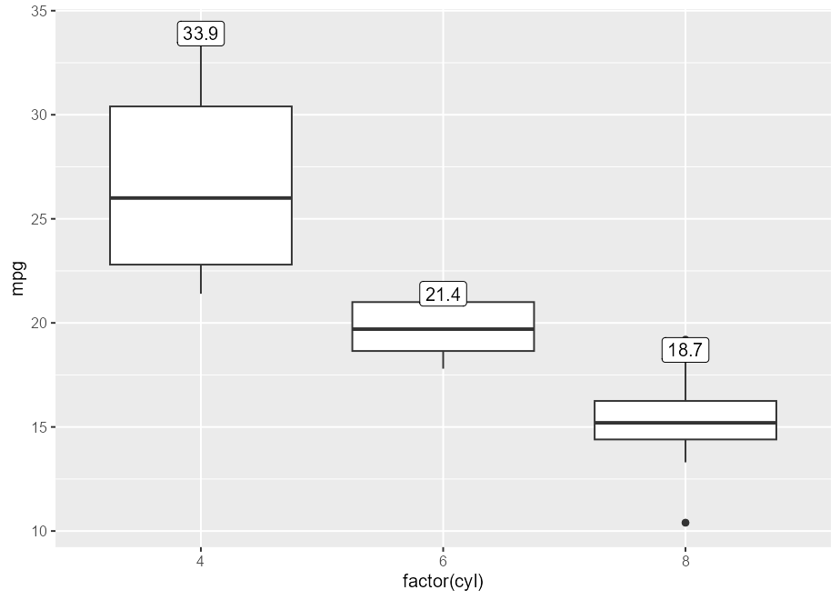

### 3) **Highjack ggproto (remove boxplot outliers)**

> Example inspired by
> <https://github.com/tidyverse/ggplot2/issues/4892>.

You can hide outliers in `geom_boxplot()` using the `outlier.`
argument(s), but they’ll still be present in the layer’s underlying
dataframe representation. Note how this method adds empty space around
the boxplot:

    boxplot_plot <- ggplot(mpg, aes(hwy, class)) +
      geom_boxplot(outlier.shape = NA)
    boxplot_plot

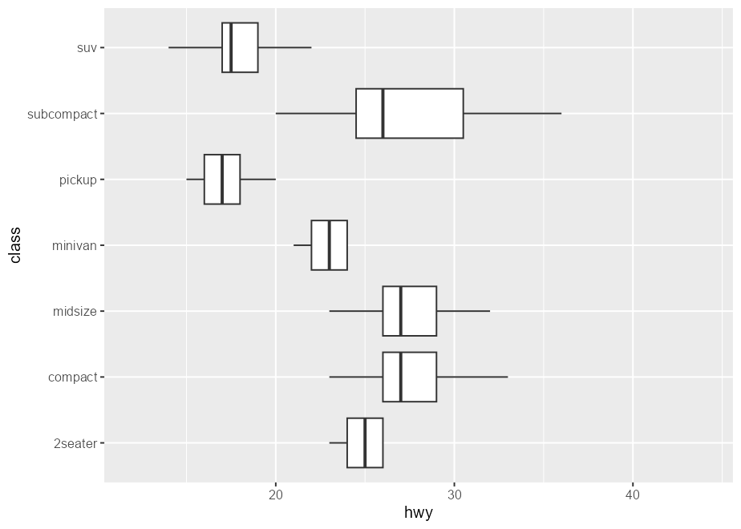

This is because the scales are re-trained after the calculation of the
boxplot statistics. In other words, the “final” min/max value of the
x-scale are derived from the calculated outliers, even if they’re not
drawn.

    layer_data(boxplot_plot)[, c("xmin", "xmax", "outliers", "xmin_final", "xmax_final")]
    #>   xmin xmax                       outliers xmin_final xmax_final
    #> 1   23   26                                        23         26
    #> 2   23   33                 35, 37, 35, 44         23         44
    #> 3   23   32                                        23         32
    #> 4   21   24                             17         17         24
    #> 5   15   20                 12, 12, 12, 22         12         22
    #> 6   20   36                         44, 41         20         44
    #> 7   14   22 12, 12, 25, 24, 27, 25, 26, 23         12         27

One solution is to highjack the calculation of the boxplot layer’s
statistics such that values of the `outliers` column is set to `NULL`.
In `ggtrace_highjack_return()`, we pass an expression that modifies
`returnValue()` to the `value` argument, which evaluates to the value
about to be returned by the method.

    ggtrace_highjack_return(
      x = boxplot_plot,
      method = Stat$compute_layer,
      cond = 1L,
      value = quote({
        transform(returnValue(), outliers = NULL)
      })
    )


Note that this is also possible in “vanilla” ggplot. Following our
earlier discussion of `after_stat()`:

    # Suppress warning from mapping to `outliers` aesthetic
    update_geom_defaults("boxplot", list(outliers = NULL))

    ggplot(mpg, aes(hwy, class)) +
      geom_boxplot(
        # Equivalent effect of modifying the after-stat data
        aes(outliers = after_stat(list(NULL)))
      )

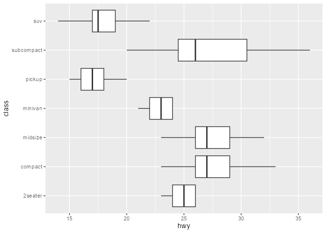

### 4) **Not just ggproto**

> Example adopted from [Github issue
> \#97](https://github.com/yjunechoe/ggtrace/issues/97#issuecomment-1402994494)

The `method` argument of `ggtrace_*()` workflow functions can be
(almost) any function-like object called during the rendering of a
ggplot.

    set.seed(2023)
    # Example from `?stat_summary`
    summary_plot <- ggplot(mtcars, aes(mpg, factor(cyl))) +
      geom_point() +
      stat_summary(fun.data = "mean_cl_boot", colour = "red", linewidth = 2, size = 3)
    summary_plot

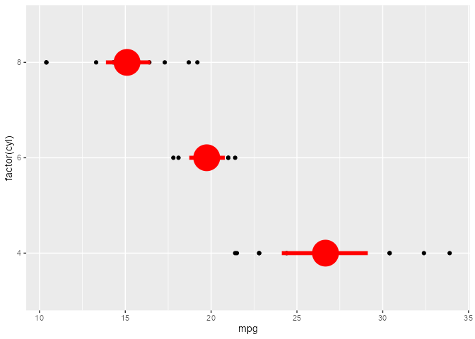

    ggtrace_inspect_args(x = summary_plot, method = mean_cl_boot)
    #> $x
    #>  [1] 22.8 24.4 22.8 32.4 30.4 33.9 21.5 27.3 26.0 30.4 21.4
    ggtrace_inspect_return(x = summary_plot, method = mean_cl_boot)
    #>          y     ymin     ymax
    #> 1 26.66364 24.11727 29.19159

    ggtrace_highjack_return(
      x = summary_plot, method = mean_cl_boot,
      value = quote({
        data.frame(y = 50, ymin = 25, ymax = 75)
      })
    )

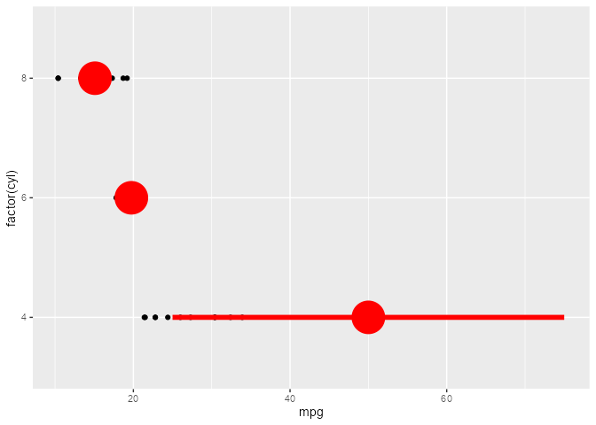

### 5) **Visually crop polar plots**

> Example adopted from a [twitter
> thread](https://twitter.com/mattansb/status/1506620436771229715?s=20)

Here’s a plot in polar coordinates:

    polar_plot <- ggplot(mtcars, aes(hp, mpg)) +
      geom_point() +
      geom_smooth(method = "lm", formula = y ~ x) +
      expand_limits(y = c(0, 60)) +
      coord_polar(start = 0, theta = "y")

    polar_plot

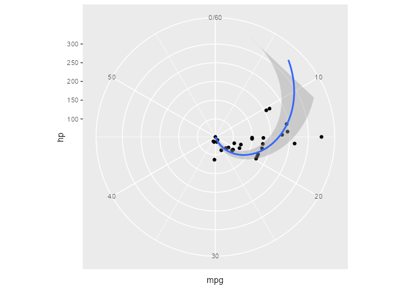

We can clip the plot panel by highjacking the `Layout$render()` method
using the generic workflow function `with_ggtrace()`:

    with_ggtrace(
      x = polar_plot + theme(aspect.ratio = 1/.48),
      method = Layout$render,
      trace_steps = 5L,
      trace_expr = quote({
        panels[[1]] <- editGrob(panels[[1]], vp = viewport(xscale = c(.48, 1)))
      }),
      out = "g"
    )

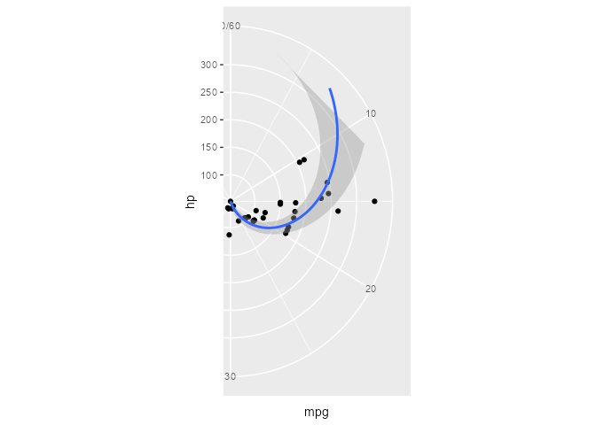

See implementation in
[`MSBMisc::crop_coord_polar()`](https://mattansb.github.io/MSBMisc/reference/crop_coord_polar.html).

### 6) **Highjack the drawing context**

> Example adopted from my [useR! 2022
> talk](https://yjunechoe.github.io/ggtrace-user2022/#/for-grid-power-users):

    library(palmerpenguins)
    flashy_plot <- na.omit(palmerpenguins::penguins) |> 
      ggplot(aes(x = species, y = flipper_length_mm)) +
      geom_boxplot(aes(fill = species), width = .7) +
      facet_wrap(~ year)
    flashy_plot

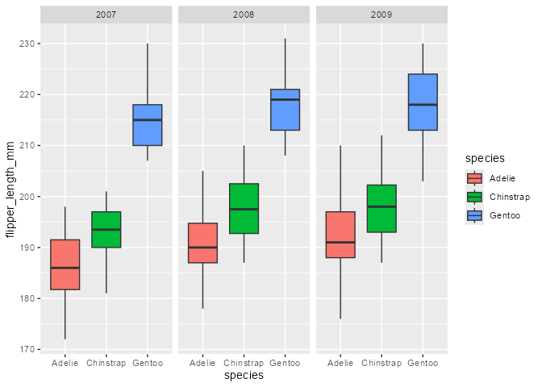

    ggtrace_highjack_return(
      flashy_plot, Geom$draw_panel, cond = TRUE,
      value = quote({
        circ <- circleGrob(y = .25 * ._counter_)
        grobTree( editGrob(circ, gp = gpar(fill = linearGradient())),
                  editGrob(returnValue(), vp = viewport(clip = circ)) )
      }))

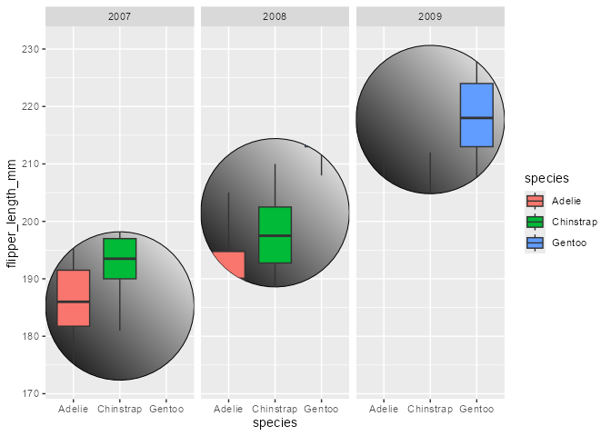

Note the use of the special variable `._counter_`, which increments
every time a function/method has been called. See the [tracing
context](https://yjunechoe.github.io/ggtrace/reference/ggtrace_highjack_args.html#tracing-context)
topic for more details.

<!-- ### **Extract legends** -->
<!-- ```{r legend-plot} -->
<!-- p_legend <- ggplot(mtcars, aes(hp, mpg, color = factor(cyl))) + -->
<!--   geom_point() + -->
<!--   geom_smooth(method = "lm", formula = y ~ x) -->
<!-- p_legend -->
<!-- ``` -->
<!-- For more control over legends, we can use `ggplot2::guide_*(override.aes = ...)`: -->
<!-- ```{r legends-make} -->
<!-- p_legend1 <- p_legend + -->
<!--   scale_color_discrete( -->
<!--     name = "cyl", -->
<!--     guide = guide_legend(override.aes = list(shape = NA, fill = NA)) -->
<!--   ) + -->
<!--   theme(legend.key = element_rect(fill = "white")) -->
<!-- p_legend2 <- p_legend + -->
<!--   scale_color_discrete( -->
<!--     name = NULL, labels = c("observation", "linear fit", "95% interval"), -->
<!--     guide = guide_legend( -->
<!--       override.aes = list( -->
<!--         shape = c(16, NA, NA), color = c("black", "black", NA), -->
<!--         linetype = c(NA, 1, NA), fill = c(NA, NA, "grey60") -->
<!--       ) -->
<!--     ) -->
<!--   ) + -->
<!--   theme(legend.key = element_rect(fill = "white")) -->
<!-- library(patchwork) -->
<!-- p_legend1 + p_legend2 -->
<!-- ``` -->
<!-- Using `ggtrace_inspect_return()`, we can grab the return value from the legend-making function for each plot and then plot them over the panel using `{patchwork}`: -->
<!-- ```{r legends-inset} -->
<!-- legend1 <- ggtrace_inspect_return(p_legend1, ggplot2:::guide_gengrob.legend) -->
<!-- legend2 <- ggtrace_inspect_return(p_legend2, ggplot2:::guide_gengrob.legend) -->
<!-- (p_legend + guides(color = guide_none())) + -->
<!--   inset_element(legend1, .7, .8, .7, .8) + -->
<!--   inset_element(legend2, .85, .8, .85, .8) -->
<!-- ``` -->
