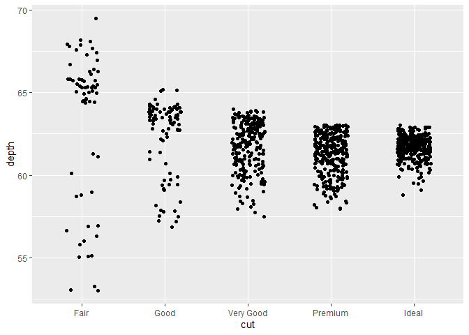
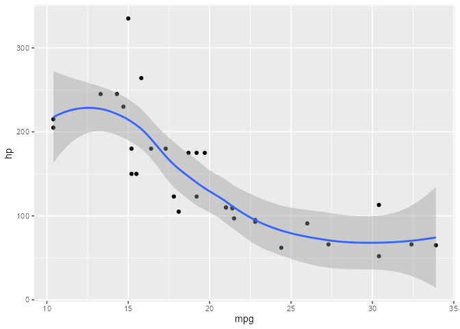
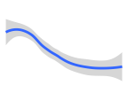
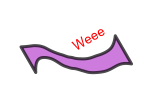
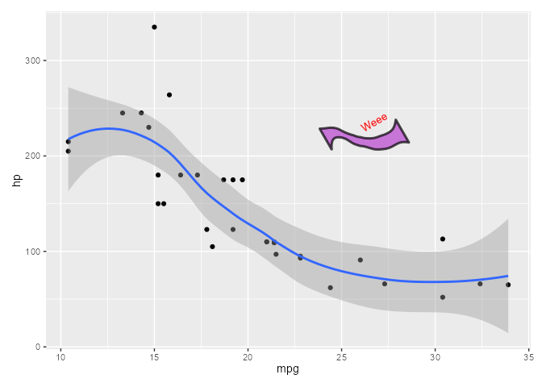
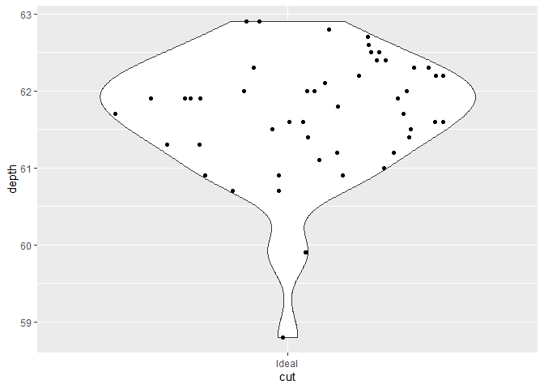
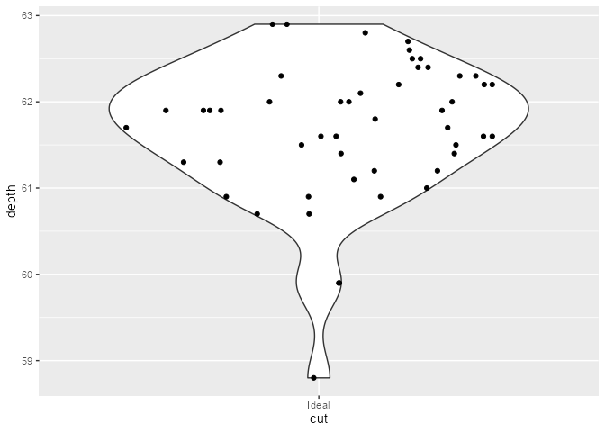
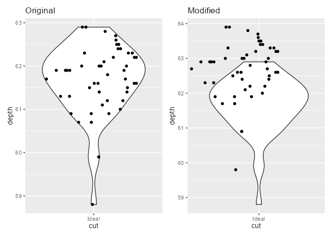

<!-- README.md is generated from README.Rmd. Please edit that file -->

# **{ggtrace}**

<!-- badges: start -->
<!-- badges: end -->

#### **Programmatically inspect, debug, and manipulate ggproto methods**

## **Why {ggtrace}?**

-   **Lightweight** ⚡
    -   The only dependency is `{rlang}` - not even `{ggplot2}`!
    -   Not a lot of code - most of the heavy lifting is done by
        `base::trace()`
-   **User-friendly** ❤
    -   Everything happens in your local session - no need to fork a
        repo to inspect the internals!
    -   The output is available for inspection outside of the debugging
        context with `last_ggtrace()` and `global_ggtrace()`
    -   Untraces on exit by default, like `debugonce()`
-   **Flexible** 🛠
    -   Works on any functions and object methods, not just ggproto!
    -   You can *programmatically* debug with `ggtrace()` or
        *interactively* debug with `ggedit()`
    -   Since `ggtrace()` doesn’t rely on interactivity, it can be used
        in `{reprex}`-es
    -   Plays nice with existing debugging tools (ex: you can insert
        `browser()` calls deep inside the body with `ggedit()`)
-   **Powerful** 💪
    -   Return the execution environment with `ggtrace()` for further
        inspection
    -   Modify the execution environment by passing assignment
        expressions to `ggtrace()`
    -   Change the source code with `ggedit()`, which is restored upon
        `gguntrace()`

More on the 📦 package website: <https://yjunechoe.github.io/ggtrace>

## **Installation**

You can install the development version from
[GitHub](https://github.com/) with:

    # install.packages("devtools")
    remotes::install_github("yjunechoe/ggtrace")

    library(ggtrace) # v0.4.3

## **Example 1 - `compute_layer` method from `PositionJitter`**

### **Step 1. Make plot**

    library(ggplot2) # v3.3.5

    jitter_plot <- ggplot(diamonds[1:1000,], aes(cut, depth)) +
      geom_point(position = position_jitter(width = 0.2, seed = 2021))
    jitter_plot

### **Step 2. Inspect body of the ggproto method**

    ggbody(PositionJitter$compute_layer)
    #> [[1]]
    #> `{`
    #> 
    #> [[2]]
    #> trans_x <- if (params$width > 0) function(x) jitter(x, amount = params$width)
    #> 
    #> [[3]]
    #> trans_y <- if (params$height > 0) function(x) jitter(x, amount = params$height)
    #> 
    #> [[4]]
    #> x_aes <- intersect(ggplot_global$x_aes, names(data))
    #> 
    #> [[5]]
    #> x <- if (length(x_aes) == 0) 0 else data[[x_aes[1]]]
    #> 
    #> [[6]]
    #> y_aes <- intersect(ggplot_global$y_aes, names(data))
    #> 
    #> [[7]]
    #> y <- if (length(y_aes) == 0) 0 else data[[y_aes[1]]]
    #> 
    #> [[8]]
    #> dummy_data <- new_data_frame(list(x = x, y = y), nrow(data))
    #> 
    #> [[9]]
    #> fixed_jitter <- with_seed_null(params$seed, transform_position(dummy_data, 
    #>     trans_x, trans_y))
    #> 
    #> [[10]]
    #> x_jit <- fixed_jitter$x - x
    #> 
    #> [[11]]
    #> y_jit <- fixed_jitter$y - y
    #> 
    #> [[12]]
    #> transform_position(data, function(x) x + x_jit, function(x) x + 
    #>     y_jit)

### **Step 3. `ggtrace()` - including the last line with keyword `~step`**

    ggtrace(
      method = PositionJitter$compute_layer,
      trace_steps = c(1, 1, 9, 12),
      trace_exprs = rlang::exprs(
        data,            # What does the data passed in look like?
        params,          # What do the initial parameters look like?
        dummy_data,      # What is `dummy_data` defined at Step 8?
        ~step            # What does the last line evaluate to?
                         # - i.e., what is returned by the method?
      ),
      print_output = FALSE   # Don't print evaluated expressions to console
    )
    #> PositionJitter$compute_layer now being traced.

    # plot not printed to save space
    jitter_plot
    #> Triggering trace on PositionJitter$compute_layer
    #> 
    #> [Step 01]> data
    #> 
    #> [Step 01]> params
    #> 
    #> [Step 09]> dummy_data
    #> 
    #> [Step 12]> transform_position(data, function(x) x + x_jit, function(x) x + y_jit)
    #> 
    #> Call `last_ggtrace()` to get the trace dump.
    #> Untracing PositionJitter$compute_layer on exit.

### **Step 4. Inspect trace dump**

    jitter_tracedump <- last_ggtrace()

    jitter_tracedump[[2]]
    #> $width
    #> [1] 0.2
    #> 
    #> $height
    #> [1] 0.04
    #> 
    #> $seed
    #> [1] 2021

    lapply(jitter_tracedump[-2], nrow)
    #> [[1]]
    #> [1] 1000
    #> 
    #> [[2]]
    #> [1] 1000
    #> 
    #> [[3]]
    #> [1] 1000

    lapply(jitter_tracedump[-2], head, 3)
    #> [[1]]
    #>   x    y PANEL group
    #> 1 5 61.5     1     5
    #> 2 4 59.8     1     4
    #> 3 2 56.9     1     2
    #> 
    #> [[2]]
    #>   x    y
    #> 1 5 61.5
    #> 2 4 59.8
    #> 3 2 56.9
    #> 
    #> [[3]]
    #>          x        y PANEL group
    #> 1 4.980507 61.50684     1     5
    #> 2 4.113512 59.77872     1     4
    #> 3 2.083873 56.86655     1     2

## **Example 2 - `draw_group` method from `GeomSmooth`**

### **Step 1. Make plot**

    smooth_plot <- ggplot(mtcars, aes(mpg, hp)) +
      geom_point() +
      stat_smooth(method = "loess", formula = y ~ x)
    smooth_plot

### **Step 2. Inspect body of the ggproto method**

    ggbody(GeomSmooth$draw_group)
    #> [[1]]
    #> `{`
    #> 
    #> [[2]]
    #> ribbon <- transform(data, colour = NA)
    #> 
    #> [[3]]
    #> path <- transform(data, alpha = NA)
    #> 
    #> [[4]]
    #> ymin = flipped_names(flipped_aes)$ymin
    #> 
    #> [[5]]
    #> ymax = flipped_names(flipped_aes)$ymax
    #> 
    #> [[6]]
    #> has_ribbon <- se && !is.null(data[[ymax]]) && !is.null(data[[ymin]])
    #> 
    #> [[7]]
    #> gList(if (has_ribbon) GeomRibbon$draw_group(ribbon, panel_params, 
    #>     coord, flipped_aes = flipped_aes), GeomLine$draw_panel(path, 
    #>     panel_params, coord))

### **Step 3. `ggtrace()` - get the `gList()`**

    ggtrace(
      method = GeomSmooth$draw_group,
      trace_steps = -1,           # Trace the last line
      trace_exprs = quote(~step), # Grab the gList() object it returns
      print_output = FALSE
    )
    #> GeomSmooth$draw_group now being traced.

    # plot not printed to save space
    smooth_plot
    #> Triggering trace on GeomSmooth$draw_group
    #> 
    #> [Step 7]> gList(if (has_ribbon) GeomRibbon$draw_group(ribbon, panel_params, coord,
    #>    flipped_aes = flipped_aes), GeomLine$draw_panel(path, panel_params, coord))
    #> 
    #> Call `last_ggtrace()` to get the trace dump.
    #> Untracing GeomSmooth$draw_group on exit.

### **Step 4. Inspect trace dump**

Get grobs in the gList and do some weird stuff with it.

This is nice because you don’t have to navigate the whole list of
`ggplotGrob(smooth_plot)[["grobs"]]`.

    smooth_tracedump <- last_ggtrace()

    smooth_gList <- smooth_tracedump[[1]]

    smooth_gList
    #> (gTree[geom_ribbon.gTree.132], polyline[GRID.polyline.133])

    library(grid)

    grid.ls(smooth_gList)
    #> geom_ribbon.gTree.132
    #>   GRID.polygon.129
    #>   GRID.polyline.130
    #> GRID.polyline.133

    grid.newpage()
    grid.draw(gTree(children = smooth_gList, vp = viewport()))

    # The weird stuff

    smooth_ribbon_polygon <- editGrob(
      smooth_gList[1][[1]],
      "polygon",
      grep = TRUE,
      gp = gpar(fill = "#b742ce", alpha = 0.7, lwd = 3, col = "black")
    )
    smooth_ribbon_gTree <- gTree(
      children = gList(
        smooth_ribbon_polygon,
        textGrob("Weee", x = .7, gp = gpar(col = "red", fontsize = unit(10, "pt")))
      ),
      vp = viewport(width = 1, height = 1, default.units = "in", angle = 30)
    )

    grid.newpage()
    grid.draw(smooth_ribbon_gTree)

You might use this for some fancy *data-driven legends* or something,
though it’s meant to be exploratory not practical.

    library(patchwork)
    smooth_plot +
      inset_element(
        wrap_elements(full = smooth_ribbon_gTree) +
          theme(plot.background = element_rect(fill = NA, color = NA)),
        left = 0.5, bottom = 0.5, right = 0.8, top = 0.8
      )

## **Example 3 - `compute_panel` method from `StatBoxplot`**

### **Step 1. Make plot**

    boxplot_plot <- ggplot(diamonds[1:500,], aes(cut, depth)) +
      geom_boxplot()
    boxplot_plot

### **Step 2. Inspect body of the ggproto method**

Actually, `"compute_panel"` method is not defined for `StatBoxplot`.
`ggbody()` gives you a hint that it may be inherited.

    ggbody(StatBoxplot$compute_panel)
    #> Error: Method compute_panel is not defined for StatBoxplot
    #> Check inheritance with `ggbody(StatBoxplot$compute_panel, inherit = TRUE)`

`StatBoxplot` is a child of the parent ggproto `Stat`, and the
`"compute_panel"` method is inherited from `Stat` as well, so that’s
what we want to trace instead:

    class(StatBoxplot)
    #> [1] "StatBoxplot" "Stat"        "ggproto"     "gg"

With `inherit = TRUE`, `ggbody()` returns the method as defined in the
closest parent, and the corresponding code to get it. We confirm that we
should be passing `Stat$compute_panel` to the `method` argument for
`ggtrace()`.

    ggbody(StatBoxplot$compute_panel, inherit = TRUE)
    #> Returning `ggbody(Stat$compute_panel)`
    #> [[1]]
    #> `{`
    #> 
    #> [[2]]
    #> if (empty(data)) return(new_data_frame())
    #> 
    #> [[3]]
    #> groups <- split(data, data$group)
    #> 
    #> [[4]]
    #> stats <- lapply(groups, function(group) {
    #>     self$compute_group(data = group, scales = scales, ...)
    #> })
    #> 
    #> [[5]]
    #> stats <- mapply(function(new, old) {
    #>     if (empty(new)) 
    #>         return(new_data_frame())
    #>     unique <- uniquecols(old)
    #>     missing <- !(names(unique) %in% names(new))
    #>     cbind(new, unique[rep(1, nrow(new)), missing, drop = FALSE])
    #> }, stats, groups, SIMPLIFY = FALSE)
    #> 
    #> [[6]]
    #> rbind_dfs(stats)

### **Step 3. `ggtrace()` - retrieve the parent environment**

`Stat$compute_panel` does split-apply-combine (Steps 3, 4-5, 6).

Let’s return the split and the combine:

    ggtrace(
      Stat$compute_panel,
      trace_steps = c(3, 6, 6),
      trace_exprs = rlang::exprs(
        splits      = ~step,         # What are the splits?
        combined    = ~step,         # What does the combined result look like?
        runtime_env = environment()  # Grab the method's execution environment
      ),
      use_names = TRUE,       # Use names of `trace_exprs` for names of the tracedump (default)
      verbose = FALSE         # Suppress all printing (except `message()`s)
                              # This entails the effects of `print_output = FALSE`
    )
    #> Stat$compute_panel now being traced.

    # plot not printed to save space
    boxplot_plot
    #> Triggering trace on Stat$compute_panel
    #> Untracing Stat$compute_panel on exit.

### **Step 4. Inspect trace dump**

    boxplot_tracedump <- last_ggtrace()

    # Trace dump is named after `trace_exprs`
    names(boxplot_tracedump)
    #> [1] "splits"      "combined"    "runtime_env"

    # Inspect the splits
    sapply(boxplot_tracedump[["splits"]], nrow)
    #>   1   2   3   4   5 
    #>  26  51 127 144 152
    lapply(boxplot_tracedump$splits, head, 3)
    #> $`1`
    #>    x    y PANEL group
    #> 9  1 65.1     1     1
    #> 92 1 55.1     1     1
    #> 98 1 66.3     1     1
    #> 
    #> $`2`
    #>    x    y PANEL group
    #> 3  2 56.9     1     2
    #> 5  2 63.3     1     2
    #> 11 2 64.0     1     2
    #> 
    #> $`3`
    #>   x    y PANEL group
    #> 6 3 62.8     1     3
    #> 7 3 62.3     1     3
    #> 8 3 61.9     1     3
    #> 
    #> $`4`
    #>    x    y PANEL group
    #> 2  4 59.8     1     4
    #> 4  4 62.4     1     4
    #> 13 4 60.4     1     4
    #> 
    #> $`5`
    #>    x    y PANEL group
    #> 1  5 61.5     1     5
    #> 12 5 62.8     1     5
    #> 14 5 62.2     1     5

    # Manually calculating some boxplot parameters
    lapply(boxplot_tracedump[["splits"]], function(group) {
      quantile(group$y, c(0, 0.25, 0.5, 0.75, 1))
    })
    #> $`1`
    #>     0%    25%    50%    75%   100% 
    #> 53.100 58.850 64.800 65.775 68.100 
    #> 
    #> $`2`
    #>    0%   25%   50%   75%  100% 
    #> 56.90 60.20 63.30 63.95 65.20 
    #> 
    #> $`3`
    #>   0%  25%  50%  75% 100% 
    #> 57.5 60.7 62.0 63.1 64.0 
    #> 
    #> $`4`
    #>     0%    25%    50%    75%   100% 
    #> 58.000 60.700 61.500 62.325 63.000 
    #> 
    #> $`5`
    #>    0%   25%   50%   75%  100% 
    #> 58.80 61.30 61.75 62.20 62.90

    # The combined result
    boxplot_tracedump[["combined"]]
    #>   ymin lower middle  upper ymax               outliers notchupper notchlower x
    #> 1 53.1 58.85  64.80 65.775 68.1                          66.94580   62.65420 1
    #> 2 56.9 60.20  63.30 63.950 65.2                          64.12967   62.47033 2
    #> 3 57.5 60.70  62.00 63.100 64.0                          62.33649   61.66351 3
    #> 4 58.3 60.70  61.50 62.325 63.0 58.0, 58.0, 58.2, 58.0   61.71396   61.28604 4
    #> 5 60.1 61.30  61.75 62.200 62.9       58.8, 59.9, 59.9   61.86534   61.63466 5
    #>   width relvarwidth flipped_aes PANEL group
    #> 1  0.75    5.099020       FALSE     1     1
    #> 2  0.75    7.141428       FALSE     1     2
    #> 3  0.75   11.269428       FALSE     1     3
    #> 4  0.75   12.000000       FALSE     1     4
    #> 5  0.75   12.328828       FALSE     1     5

Using the returned environment opens up more powerful manipulations:

    # What was inside the method environment?
    ls(envir = boxplot_tracedump[["runtime_env"]])
    #> [1] "data"   "groups" "scales" "self"   "stats"

    # Evaluate the expression in Step 6 with the method's runtime environment
    eval(
      ggbody(Stat$compute_panel)[[6]],
      envir = boxplot_tracedump[["runtime_env"]]
    )
    #>   ymin lower middle  upper ymax               outliers notchupper notchlower x
    #> 1 53.1 58.85  64.80 65.775 68.1                          66.94580   62.65420 1
    #> 2 56.9 60.20  63.30 63.950 65.2                          64.12967   62.47033 2
    #> 3 57.5 60.70  62.00 63.100 64.0                          62.33649   61.66351 3
    #> 4 58.3 60.70  61.50 62.325 63.0 58.0, 58.0, 58.2, 58.0   61.71396   61.28604 4
    #> 5 60.1 61.30  61.75 62.200 62.9       58.8, 59.9, 59.9   61.86534   61.63466 5
    #>   width relvarwidth flipped_aes PANEL group
    #> 1  0.75    5.099020       FALSE     1     1
    #> 2  0.75    7.141428       FALSE     1     2
    #> 3  0.75   11.269428       FALSE     1     3
    #> 4  0.75   12.000000       FALSE     1     4
    #> 5  0.75   12.328828       FALSE     1     5

    # Manually call the compute_group method from StatBoxplot to apply
    # transformation to the third group using the method environment
    eval(
      quote(StatBoxplot$compute_group(groups[[3]], scales, ...)),
      envir = boxplot_tracedump[["runtime_env"]]
    )
    #>   ymin lower middle upper ymax outliers notchupper notchlower x width
    #> 1 57.5  60.7     62  63.1   64            62.33649   61.66351 3  0.75
    #>   relvarwidth flipped_aes
    #> 1    11.26943       FALSE

## **Example 4 - `compute_group` method from `StatSina` {ggforce}**

### **Step 1. Make plot**

    library(ggforce) # v.0.3.3

    sina_plot <- ggplot(diamonds[diamonds$cut == "Ideal",][1:50,], aes(cut, depth)) +
      geom_violin() +
      geom_sina(seed = 2021) +
      ggtitle("Original")
    sina_plot

### **Step 2. Inspect body of the ggproto method**

    ggbody(StatSina$compute_group)
    #> [[1]]
    #> `{`
    #> 
    #> [[2]]
    #> if (nrow(data) == 0) return(NULL)
    #> 
    #> [[3]]
    #> if (nrow(data) < 3) {
    #>     data$density <- 0
    #>     data$scaled <- 1
    #> } else if (method == "density") {
    #>     range <- range(data$y, na.rm = TRUE)
    #>     bw <- calc_bw(data$y, bw)
    #>     dens <- compute_density(data$y, data$w, from = range[1], 
    #>         to = range[2], bw = bw, adjust = adjust, kernel = kernel)
    #>     densf <- stats::approxfun(dens$x, dens$density, rule = 2)
    #>     data$density <- densf(data$y)
    #>     data$scaled <- data$density/max(dens$density)
    #>     data
    #> } else {
    #>     bin_index <- cut(data$y, bins, include.lowest = TRUE, labels = FALSE)
    #>     data$density <- tapply(bin_index, bin_index, length)[as.character(bin_index)]
    #>     data$density[data$density <= bin_limit] <- 0
    #>     data$scaled <- data$density/max(data$density)
    #> }
    #> 
    #> [[4]]
    #> if (length(unique(data$x)) > 1) {
    #>     width <- diff(range(data$x)) * maxwidth
    #> } else {
    #>     width <- maxwidth
    #> }
    #> 
    #> [[5]]
    #> data$width <- width
    #> 
    #> [[6]]
    #> data$n <- nrow(data)
    #> 
    #> [[7]]
    #> data$x <- mean(range(data$x))
    #> 
    #> [[8]]
    #> data

### **Step 3. `ggtrace()` - inject code that modifies method env**

    ggtrace(
      method = StatSina$compute_group,
      trace_steps = c(1, 1, 8),
      trace_exprs = rlang::exprs(
        data,                      # 1. What does the data passed in look like at the start?
        data <- dplyr::mutate(     # 2. Modify data in-place in the method environment
          data,         
          y = y + 1,                 # Shift the points up
          x = x - .2                 # Shift the points left
        ),
        data                       # 3. What do the stat transformations on the
                                   #    manipulated data look like at the end?
      ),
      verbose = FALSE
    )
    #> StatSina$compute_group now being traced.

    sina_plot_modified <- ggplotGrob(sina_plot + ggtitle("Modified"))
    #> Triggering trace on StatSina$compute_group
    #> Untracing StatSina$compute_group on exit.
    grid.draw(sina_plot_modified)

This effect is ephemeral with the `once = TRUE` default in `ggtrace()`,
meaning that only this last plot saved to `sina_plot_modified` is
rendered with the modifications.

Here we confirm that the method is restored on exit:

    sina_plot

    sina_plot + wrap_elements(full = sina_plot_modified)

### **Step 4. Inspect trace dump**

    sina_tracedump <- last_ggtrace()

    # StatSina did calculations on the modified data in the last `ggtrace()`
    lapply(sina_tracedump, head, 3)
    #> [[1]]
    #>   x    y PANEL group
    #> 1 1 61.5     1     1
    #> 2 1 62.8     1     1
    #> 3 1 62.2     1     1
    #> 
    #> [[2]]
    #>     x    y PANEL group
    #> 1 0.8 62.5     1     1
    #> 2 0.8 63.8     1     1
    #> 3 0.8 63.2     1     1
    #> 
    #> [[3]]
    #>     x    y PANEL group   density    scaled width  n
    #> 1 0.8 62.5     1     1 0.4632389 0.8454705   0.9 50
    #> 2 0.8 63.8     1     1 0.2134967 0.3896590   0.9 50
    #> 3 0.8 63.2     1     1 0.4973098 0.9076543   0.9 50
