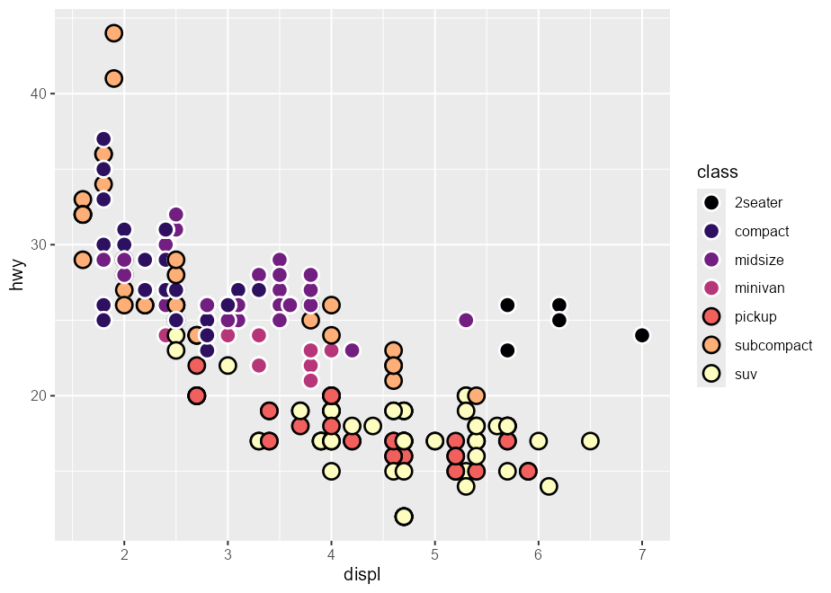
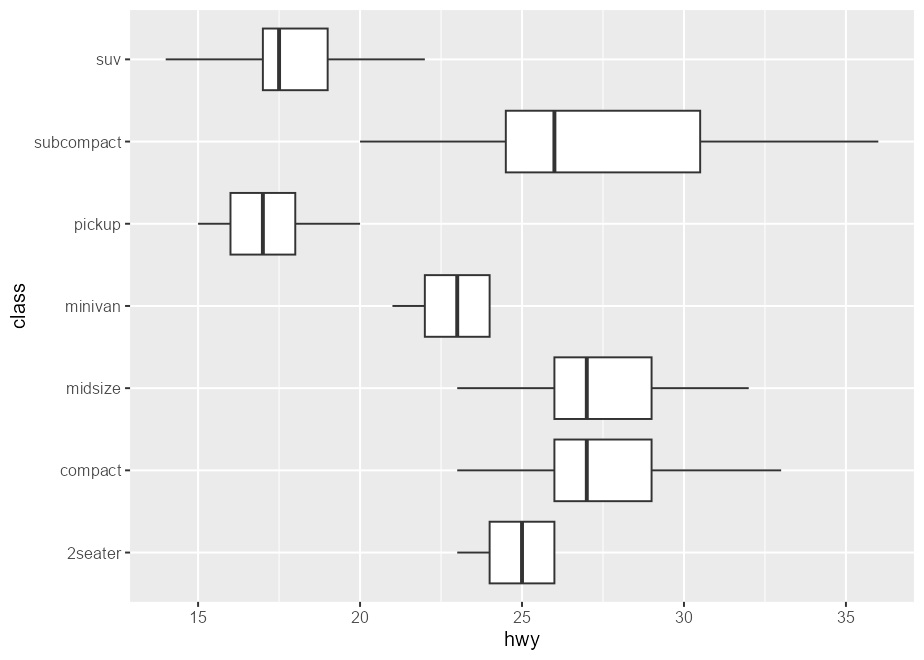

<!-- README.md is generated from README.Rmd. Please edit that file -->

# **{ggtrace}** 

#### **Programmatically explore, debug, and manipulate ggplot internals**

<!-- badges: start -->

[](https://github.com/yjunechoe/ggtrace)
<!-- badges: end -->


### **Installation**

You can install the development version from
[GitHub](https://github.com/yjunechoe/ggtrace/) with:

    # install.packages("remotes")
    remotes::install_github("yjunechoe/ggtrace")

    library(ggtrace)

More on the 📦 package website: <https://yjunechoe.github.io/ggtrace>

### **Description**

`{ggtrace}` embodies an opinionated approach to learning about ggplot
internals. The internals is a difficult topic, so I recommend watching
the following presentations on `{ggtrace}` before getting started on any
kind of code:

-   [Presentation at
    rstudio::conf(2022)](https://www.rstudio.com/conference/2022/talks/cracking-open-ggplot-internals-ggtrace/)

-   [Presentation at useR!
    2022](https://www.youtube.com/watch?v=2JX8zu4QxMg&t=2959s)

Read more about the philosophy behind `{ggtrace}` in the [Getting
Started](https://yjunechoe.github.io/ggtrace/articles/getting-started.html)
vignette, and see examples in the
[Overview](https://yjunechoe.github.io/ggtrace/articles/overview.html)
vignette.

## **Example usage**

    library(ggplot2)
    packageVersion("ggplot2")
    #> [1] '3.4.0'

### 1) **Inspect sub-layer data**

A bar plot of counts with `geom_bar()` with `stat = "count"` default:

    bar_plot <- ggplot(mpg, aes(class, fill = class)) +
      geom_bar() +
      theme(legend.position = "none")

State of bar layer’s data after the statistical transformation step:

    ggtrace::layer_after_stat(bar_plot)
    #> ✔ Executed `ggtrace_inspect_return(bar_plot, ggplot2:::Layer$compute_statistic)`
    #> # A tibble: 7 × 8
    #>   count  prop x          width flipped_aes fill       PANEL group
    #>   <dbl> <dbl> <mppd_dsc> <dbl> <lgl>       <chr>      <fct> <int>
    #> 1     5     1 1            0.9 FALSE       2seater    1         1
    #> 2    47     1 2            0.9 FALSE       compact    1         2
    #> 3    41     1 3            0.9 FALSE       midsize    1         3
    #> 4    11     1 4            0.9 FALSE       minivan    1         4
    #> 5    33     1 5            0.9 FALSE       pickup     1         5
    #> 6    35     1 6            0.9 FALSE       subcompact 1         6
    #> 7    62     1 7            0.9 FALSE       suv        1         7

We can map aesthetics to variables from the after-stat data using
`after_stat()`:

    bar_plot +
      geom_text(
        aes(label = after_stat(count)),
        stat = "count",
        position = position_nudge(y = 1), vjust = 0
      )


Same idea with `after_scale()`:

    scatter_plot <- ggplot(mpg, aes(displ, hwy, fill = class)) +
      scale_fill_viridis_d(option = "magma")
    scatter_plot +
      geom_point(shape = 21, size = 4, stroke = 1)


    # `fill` column available for `after_scale(fill)`
    ggtrace::layer_after_scale(scatter_plot)
    #> ✔ Executed `ggtrace_inspect_return(scatter_plot, ggplot2:::Layer$compute_geom_2)`
    #> # A tibble: 234 × 5
    #>    fill          x     y PANEL group
    #>    <chr>     <dbl> <dbl> <fct> <int>
    #>  1 #2D1160FF   1.8    29 1         2
    #>  2 #2D1160FF   1.8    29 1         2
    #>  3 #2D1160FF   2      31 1         2
    #>  4 #2D1160FF   2      30 1         2
    #>  5 #2D1160FF   2.8    26 1         2
    #>  6 #2D1160FF   2.8    26 1         2
    #>  7 #2D1160FF   3.1    27 1         2
    #>  8 #2D1160FF   1.8    26 1         2
    #>  9 #2D1160FF   1.8    25 1         2
    #> 10 #2D1160FF   2      28 1         2
    #> # … with 224 more rows

    scatter_plot +
      geom_point(
        aes(color = after_scale(prismatic::best_contrast(fill))),
        shape = 21, size = 4, stroke = 1
      )



### 2) **Highjack ggproto (remove boxplot outliers)**

You can hide outliers in `geom_boxplot()`, but they’ll still be in the
layer’s underlying dataframe representation. This makes the plot look
stretched:

    boxplot_plot <- ggplot(mpg, aes(hwy, class)) +
      geom_boxplot(outlier.shape = NA)
    boxplot_plot


This is because the scales are re-trained after the calculation of the
boxplot statistics. In other words, the “final” min/max value of the
x-scale are derived from the calculated outliers, even if they’re not
drawn.

    layer_data(boxplot_plot)[, c("xmin", "xmax", "outliers", "xmin_final", "xmax_final")]
    #>   xmin xmax                       outliers xmin_final xmax_final
    #> 1   23   26                                        23         26
    #> 2   23   33                 35, 37, 35, 44         23         44
    #> 3   23   32                                        23         32
    #> 4   21   24                             17         17         24
    #> 5   15   20                 12, 12, 12, 22         12         22
    #> 6   20   36                         44, 41         20         44
    #> 7   14   22 12, 12, 25, 24, 27, 25, 26, 23         12         27

One solution is to highjack the calculation of the boxplot layer’s
statistics such that values of the `outliers` column is set to `NULL`.
In `ggtrace_highjack_return()`, we pass an expression that modifies
`returnValue()` to the `value` argument, which evaluates to the value
about to be returned by the method.

    ggtrace_highjack_return(
      x = boxplot_plot,
      method = Stat$compute_layer,
      cond = 1L,
      value = quote({
        transform(returnValue(), outliers = NULL)
      })
    )


Problem inspired by <https://github.com/tidyverse/ggplot2/issues/4892>.

Note that this is also possible in “vanilla” ggplot. Following our
earlier discussion of `after_stat()`:

    # Suppress warning from mapping to `outliers` aesthetic
    update_geom_defaults("boxplot", list(outliers = NULL))

    ggplot(mpg, aes(hwy, class)) +
      geom_boxplot(
        # Equivalent effect of modifying the after-stat data
        aes(outliers = after_stat(list(NULL)))
      )



### 3) **Not just ggproto**

The `method` argument of `ggtrace_*()` workflow functions can be
(almost) any function-like object called during the rendering of a
ggplot.

    set.seed(2023)
    # Example from `?stat_summary`
    summary_plot <- ggplot(mtcars, aes(mpg, factor(cyl))) +
      geom_point() +
      stat_summary(fun.data = "mean_cl_boot", colour = "red", linewidth = 2, size = 3)
    summary_plot


    ggtrace_inspect_args(x = summary_plot, method = mean_cl_boot)
    #> $x
    #>  [1] 22.8 24.4 22.8 32.4 30.4 33.9 21.5 27.3 26.0 30.4 21.4
    ggtrace_inspect_return(x = summary_plot, method = mean_cl_boot)
    #>          y     ymin     ymax
    #> 1 26.66364 24.11727 29.19159

    ggtrace_highjack_return(
      x = summary_plot, method = mean_cl_boot,
      value = quote({
        data.frame(y = 50, ymin = 25, ymax = 75)
      })
    )


### 4) **Crop polar coordinate plots**

Plot in polar coordinates:

    polar_plot <- ggplot(mtcars, aes(hp, mpg)) +
      geom_point() +
      geom_smooth(method = "lm", formula = y ~ x) +
      expand_limits(y = c(0, 60)) +
      coord_polar(start = 0, theta = "y")

    polar_plot


Clipping the plot panel with `{ggtrace}` by highjacking the
`Layout$render()` method:

    ggtrace::with_ggtrace(
      x = polar_plot + theme(aspect.ratio = 1/.48),
      method = Layout$render,
      trace_steps = 5L,
      trace_expr = quote({
        panels[[1]] <- editGrob(panels[[1]], vp = viewport(xscale = c(0.48, 1)))
      }),
      out = "g"
    )


See implementation in
[`MSBMisc::crop_coord_polar()`](https://mattansb.github.io/MSBMisc/reference/crop_coord_polar.html).

### 5) **Highjack the drawing context**

Flashy example adopted from my [UseR!
talk](https://yjunechoe.github.io/ggtrace-user2022/#/for-grid-power-users):

    library(palmerpenguins)
    flashy_plot <- na.omit(palmerpenguins::penguins) |> 
      ggplot(aes(x = species, y = flipper_length_mm)) +
      geom_boxplot(aes(fill = species), width = .7) +
      facet_wrap(~ year)
    flashy_plot


    ggtrace_highjack_return(
      flashy_plot, Geom$draw_panel, cond = TRUE,
      value = quote({
        circ <- circleGrob(y = .25 * ._counter_)
        grobTree( editGrob(circ, gp = gpar(fill = linearGradient())),
                  editGrob(returnValue(), vp = viewport(clip = circ)) )
      }))


<!-- ### **Extract legends** -->
<!-- ```{r legend-plot} -->
<!-- p_legend <- ggplot(mtcars, aes(hp, mpg, color = factor(cyl))) + -->
<!--   geom_point() + -->
<!--   geom_smooth(method = "lm", formula = y ~ x) -->
<!-- p_legend -->
<!-- ``` -->
<!-- For more control over legends, we can use `ggplot2::guide_*(override.aes = ...)`: -->
<!-- ```{r legends-make} -->
<!-- p_legend1 <- p_legend + -->
<!--   scale_color_discrete( -->
<!--     name = "cyl", -->
<!--     guide = guide_legend(override.aes = list(shape = NA, fill = NA)) -->
<!--   ) + -->
<!--   theme(legend.key = element_rect(fill = "white")) -->
<!-- p_legend2 <- p_legend + -->
<!--   scale_color_discrete( -->
<!--     name = NULL, labels = c("observation", "linear fit", "95% interval"), -->
<!--     guide = guide_legend( -->
<!--       override.aes = list( -->
<!--         shape = c(16, NA, NA), color = c("black", "black", NA), -->
<!--         linetype = c(NA, 1, NA), fill = c(NA, NA, "grey60") -->
<!--       ) -->
<!--     ) -->
<!--   ) + -->
<!--   theme(legend.key = element_rect(fill = "white")) -->
<!-- library(patchwork) -->
<!-- p_legend1 + p_legend2 -->
<!-- ``` -->
<!-- Using `ggtrace_inspect_return()`, we can grab the return value from the legend-making function for each plot and then plot them over the panel using `{patchwork}`: -->
<!-- ```{r legends-inset} -->
<!-- legend1 <- ggtrace_inspect_return(p_legend1, ggplot2:::guide_gengrob.legend) -->
<!-- legend2 <- ggtrace_inspect_return(p_legend2, ggplot2:::guide_gengrob.legend) -->
<!-- (p_legend + guides(color = guide_none())) + -->
<!--   inset_element(legend1, .7, .8, .7, .8) + -->
<!--   inset_element(legend2, .85, .8, .85, .8) -->
<!-- ``` -->
