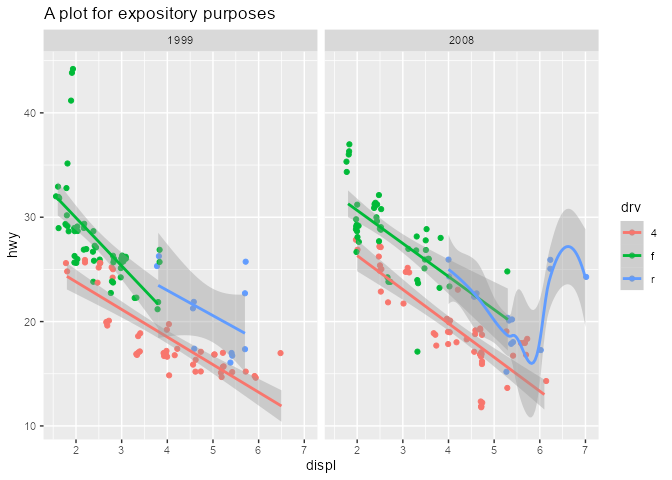
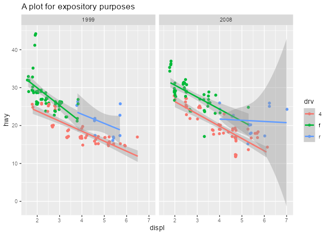
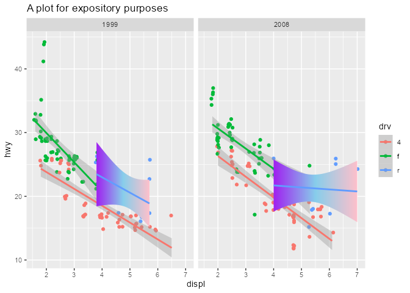

<!-- README.md is generated from README.Rmd. Please edit that file -->

# **{ggtrace}**

#### **Programmatically explore, debug, and manipulate ggplot internals**

<!-- badges: start -->

<!-- badges: end -->

### **Installation**

You can install the development version from
[GitHub](https://github.com/yjunechoe/ggtrace/) with:

    # install.packages("remotes")
    remotes::install_github("yjunechoe/ggtrace")

    library(ggtrace) # v0.5.1

More on the 📦 package website: <https://yjunechoe.github.io/ggtrace>

## **Extending `base::trace()` with `ggtrace()`**

The low-level function `ggtrace()` is designed for interacting with
functions and ggproto methods in the `{ggplot2}` ecosystem, from the
“outside”.

Formally put, `ggtrace()` allows the user to inject arbitrary
expressions (called **traces**) to functions and methods that are
evaluated over the execution of a ggplot. When “triggered” by the
evaluation of the ggplot, these traces may modify the resulting
graphical output, or they may simply log their values to the “tracedump”
for further inspection by the user. Check out the [FAQ
vignette](https://yjunechoe.github.io/ggtrace/articles/FAQ.html) for
more details.

Briefly, there are three key arguments to `ggtrace()`:

-   `method`: what function/method to trace
-   `trace_steps`: where in the body to inject expressions
-   `trace_exprs` what expressions to inject

A simple example:

    dummy_fn <- function(x = 1, y = 2) {
      z <- x + y
      return(z)
    }
    dummy_fn()
    #> [1] 3

Essentially, `ggtrace()` allows you to inject code into a function and
safely/temporarily change its execution behavior.

The following code injects the code `z <- z * 10` right as `dummy_fn`
enters the third “step” in the body, *right before* the line `return(z)`
is ran.

    body(dummy_fn)[[3]]
    #> return(z)

Note that the value of `trace_exprs` must be of type “language” (a
quoted expression), the idea being that we are *injecting* code to be
evaluate inside the function when it is called. Often, providing the
code wrapped in `quote()` suffices. For more complex injections see the
[Expressions chapter of Advanced
R](https://adv-r.hadley.nz/expressions.html)

    ggtrace(
      method = dummy_fn,
      trace_steps = 3,
      trace_exprs = quote(z <- z * 10)
    )
    #> `dummy_fn` now being traced.

After this `ggtrace()` call, the next time `dummy_fn` is called it is
run with this injected code.

    dummy_fn()
    #> Triggering trace on `dummy_fn`
    #> Untracing `dummy_fn` on exit.
    #> [1] 30

Essentially, `dummy_fn` ran with this following modified code just now:

    dummy_fn_traced <- function(x = 1, y = 2) {
      z <- x + y
      z <- z * 10 #< Look here!
      return(z)
    }
    dummy_fn_traced()
    #> [1] 30

By default, traces created by `{ggtrace}` functions delete themselves
after being triggered. You can also check whether a function is
currently being traced with `is_traced()`.

    is_traced(dummy_fn)
    #> [1] FALSE

`{ggtrace}` automatically logs the output of triggered trace to what we
call **tracedumps**. For example, `last_ggtrace()` stores the output of
the *last* trace created by `ggtrace()`:

    # The value of `(z <- z * 10)` when it was ran
    last_ggtrace() # Note that this is a list of length `trace_steps`
    #> [[1]]
    #> [1] 30

See the references section [**Extending
base::trace()**](https://yjunechoe.github.io/ggtrace/reference/index.html#extending-base-trace-)
for more functionalities offered by `ggtrace()`.

## **Workflows for interacting with ggplot internals**

    library(ggplot2) # v3.3.5

Admittedly, `ggtrace()` is a bit too clunky for interactive explorations
of ggplot internals. To address this, we offer “workflow” functions in
the form of `ggtrace_{action}_{value}()`. These are grouped into three
workflows: Inspect, Capture, and Highjack.

**NOTE**: Making the most out of these workflow functions requires a
hint of knowledge about ggplot internals, namely the fact that **ggproto
objects** like
[Stat](https://ggplot2.tidyverse.org/reference/ggplot2-ggproto.html#stats)
and
[Geom](https://ggplot2.tidyverse.org/reference/ggplot2-ggproto.html#geoms)
exists, and that these [ggprotos have
methods](https://ggplot2-book.org/spring1.html#methods) that step in at
different parts of the ggplot build/render pipeline to modify the data.
If you are completely new to these concepts, you should at least watch
[Thomas Lin Pedersen](https://twitter.com/thomasp85)’s talk on
[Extending your ability to extend
ggplot2](https://www.rstudio.com/resources/rstudioconf-2020/extending-your-ability-to-extend-ggplot2/)
before proceeding.

### **Walkthrough with `geom_smooth()`**

Say we want to learn more about how `geom_smooth()` layer works, exactly

    geom_smooth()
    #> geom_smooth: na.rm = FALSE, orientation = NA, se = TRUE
    #> stat_smooth: na.rm = FALSE, orientation = NA, se = TRUE
    #> position_identity

To do this, we’re going to adopt the example from the [ggplot2 internals
chapter of the ggplot book](https://ggplot2-book.org/internals.html)

    p <- ggplot(mpg, aes(displ, hwy, color = drv)) + 
      geom_point(position = position_jitter(seed = 1116)) +
      geom_smooth(method = "lm", formula = y ~ x) + 
      facet_wrap(vars(year)) + 
      ggtitle("A plot for expository purposes")
    p

Let’s focus on the Stat ggproto. We see that `geom_smooth()` uses the
`StatSmooth` ggproto

    class( geom_smooth()$stat )
    #> [1] "StatSmooth" "Stat"       "ggproto"    "gg"

    identical(StatSmooth, geom_smooth()$stat)
    #> [1] TRUE

The bulk of the work by a Stat is done in the `compute_*` family of
methods, which are essentially just functions. We’ll focus on
`compute_group` here:

    # ggproto methods wrap over the actual function and print extra info
    class( StatSmooth$compute_group )
    #> [1] "ggproto_method"

    # Use `get_method` to pull out just the function component
    class( get_method(StatSmooth$compute_group) )
    #> [1] "function"

    # StatSmooth inherits `compute_layer`/`compute_panel` and defines `compute_group`
    get_method_inheritance(StatSmooth)
    #> $Stat
    #>  [1] "aesthetics"      "compute_layer"   "compute_panel"   "default_aes"    
    #>  [5] "finish_layer"    "non_missing_aes" "optional_aes"    "parameters"     
    #>  [9] "retransform"     "setup_data"     
    #> 
    #> $StatSmooth
    #> [1] "compute_group" "extra_params"  "required_aes"  "setup_params"

### **Inspect**

Here we introduce our first workflow function `ggtrace_inspect_n()`,
which takes a ggplot as the first argument and a ggproto method as the
second argument, returning the number of times the ggproto method has
been called in the ggplot’s evaluation:

    ggtrace_inspect_n(x = p, method = StatSmooth$compute_group)
    #> [1] 6

As we might have guessed, `StatSmooth$compute_group` is called for each
fitted line (each group) in the plot. But if `StatSmooth$compute_group`
is essentially a function, what does it return?

We can answer that with another workflow function
`ggtrace_inspect_return()`, which shares a similar syntax:

    return_val <- ggtrace_inspect_return(x = p, method = StatSmooth$compute_group)

    dim(return_val)
    #> [1] 80  6

    head(return_val)
    #>          x        y     ymin     ymax        se flipped_aes
    #> 1 1.800000 24.33592 23.07845 25.59339 0.6250675       FALSE
    #> 2 1.859494 24.17860 22.94830 25.40890 0.6115600       FALSE
    #> 3 1.918987 24.02127 22.81795 25.22460 0.5981528       FALSE
    #> 4 1.978481 23.86395 22.68738 25.04052 0.5848527       FALSE
    #> 5 2.037975 23.70663 22.55658 24.85668 0.5716673       FALSE
    #> 6 2.097468 23.54931 22.42554 24.67307 0.5586045       FALSE

Note that `ggtrace_inspect_return()` only gave us 1 dataframe,
corresponding to the return value of `StatSmooth$compute_group` the
*first time* it was called. This comes from the default value of the
third argument `cond` being set to `quote(._counter_ == 1)`.

As you might have guessed, `._counter_` is an internal variable that
keeps track of how many times the method has been called. It’s available
for all workflow functions and you can read more in the [**Tracing
context**](https://yjunechoe.github.io/ggtrace/reference/ggtrace_inspect_return.html#tracing-context)
section of the docs.

If we instead wanted to get the return value of
`StatSmooth$compute_group` for the third group of the second panel, for
example, we can do so in one of two ways:

1.  Set the value of `cond` to an expression that evaluates to true for
    that panel and group:

        return_val_2_3_A <- ggtrace_inspect_return(
          x = p,
          method = StatSmooth$compute_group,
          cond = quote(data$PANEL[1] == 2 && data$group[1] == 3)
        )

2.  Find the counter value when that condition is satisfied with
    `ggtrace_inspect_which()`, and then simply check for the value of
    `._counter_` back in `ggtrace_inspect_return()`:

        ggtrace_inspect_which(
          x = p,
          method = StatSmooth$compute_group,
          cond = quote(data$PANEL[1] == 2 && data$group[1] == 3)
        )
        #> [1] 6

        return_val_2_3_B <- ggtrace_inspect_return(
          x = p,
          method = StatSmooth$compute_group,
          cond = 6L # shorthand for `quote(._counter_ == 6L)`
        )

These two approaches work the same:

    identical(return_val_2_3_A, return_val_2_3_B)
    #> [1] TRUE

### **Capture**

Okay, so we know what `StatSmooth$compute_group` returns, but how does
this return value change with different input? More generally put, how
does `StatSmooth$compute_group` behave under different contexts?

We *could* answer this by making a bunch of different plots using
`geom_smooth()` and repeating the inspection workflow. Alternatively, we
can capture a call to `StatSmooth$compute_group` and extract it as a
function with `ggtrace_capture_fn()`:

    captured_fn_2_3 <- ggtrace_capture_fn(
      x = p,
      method = StatSmooth$compute_group,
      cond = quote(data$PANEL[1] == 2 && data$group[1] == 3)
    )

`captured_fn_2_3` is essentially a snapshot of the `compute_group` when
it is called for the third group of the second panel. Simply calling
`captured_fn_2_3` gives us the expected return value:

    identical(return_val_2_3_A, captured_fn_2_3())
    #> [1] TRUE

But the true power of the “capture” workflow functions lies in the
ability to interact with what has been captured. In the case of
`ggtrace_capture_fn()`, the returned function has all of the arguments
passed to it at its execution stored in the formals.

In other words, it is “pre-filled” with its original values, which we
can inspect with `formals()`:

    # Just showing their type/class for space
    sapply( formals(captured_fn_2_3) , class)
    #>         data       scales       method      formula           se 
    #> "data.frame"       "list"  "character"    "formula"    "logical" 
    #>            n         span    fullrange         xseq        level 
    #>    "numeric"    "numeric"    "logical"       "NULL"    "numeric" 
    #>  method.args        na.rm  flipped_aes 
    #>       "list"    "logical"    "logical"

This makes it very convenient for us to explore its behavior with
different arguments passed to it.

For example, when `flipped_aes = TRUE`, we get `xmin` and `xmax` columns
replacing `ymin` and `ymax`:

    head( captured_fn_2_3(flipped_aes = TRUE) )
    #>          y        x     xmin     xmax        se flipped_aes
    #> 1 15.00000 5.450710 4.369619 6.531802 0.4961840        TRUE
    #> 2 15.13924 5.448163 4.385577 6.510749 0.4876904        TRUE
    #> 3 15.27848 5.445616 4.401438 6.489794 0.4792416        TRUE
    #> 4 15.41772 5.443068 4.417196 6.468941 0.4708400        TRUE
    #> 5 15.55696 5.440521 4.432846 6.448196 0.4624882        TRUE
    #> 6 15.69620 5.437974 4.448381 6.427566 0.4541888        TRUE

In this sense, we can effectively simulate what happens in
`geom_smooth(orientation = "y")` without needing to construct an
entirely different ggplot.

For another example, when we set the confidence interval to 10% with
`level = 0.1`, the `ymin` and `ymax` values deviate less from the `y`
value:

    head( captured_fn_2_3(level = 0.1) )
    #>          x        y     ymin     ymax       se flipped_aes
    #> 1 4.000000 21.70513 21.46539 21.94487 1.867921       FALSE
    #> 2 4.037975 21.69321 21.45840 21.92801 1.829458       FALSE
    #> 3 4.075949 21.68128 21.45137 21.91119 1.791313       FALSE
    #> 4 4.113924 21.66936 21.44430 21.89442 1.753509       FALSE
    #> 5 4.151899 21.65743 21.43718 21.87769 1.716067       FALSE
    #> 6 4.189873 21.64551 21.43001 21.86101 1.679011       FALSE

Lastly, let’s talk about the `data` variable we’ve been using inside the
`cond` argument of some of these workflow functions. What is
`data$group` and `data$PANEL`? How do you know what `data` looks like?

The answer is actually simple: it’s an argument passed to
`StatSmooth$compute_group`. We already saw its value briefly from
`formals(captured_fn_2_3)`, but to target it explicitly we can also use
`ggtrace_inspect_args()`:

    args_2_3 <- ggtrace_inspect_args(
      x = p,
      method = StatSmooth$compute_group,
      cond = quote(data$PANEL[1] == 2 && data$group[1] == 3)
    )

    identical(names(args_2_3), names(formals(captured_fn_2_3)))
    #> [1] TRUE

    args_2_3$data
    #>      x  y colour PANEL group
    #> 10 5.3 20      r     2     3
    #> 11 5.3 15      r     2     3
    #> 12 5.3 20      r     2     3
    #> 13 6.0 17      r     2     3
    #> 14 6.2 26      r     2     3
    #> 15 6.2 25      r     2     3
    #> 16 7.0 24      r     2     3
    #> 43 5.4 18      r     2     3
    #> 48 4.0 26      r     2     3
    #> 49 4.0 24      r     2     3
    #> 50 4.6 23      r     2     3
    #> 51 4.6 22      r     2     3
    #> 52 5.4 20      r     2     3
    #> 73 5.4 18      r     2     3

We see that `PANEL` and `group` columns conveniently give us information
about the panel and group that `compute_group` is doing calculations
over.

### **Highjack**

Once we have some understanding of how `StatSmooth$compute_group` works,
we may want to test some hypotheses about what would happen to the
resulting graphical output if the method returned something else.

Let’s revisit our examples from the Capture workflow. What if the third
group of the second panel calculated a more conservative confidence
interval (`level = 0.1`)? What is this effect on the graphical output?

To answer this question, we use `ggtrace_highjack_return()` to have a
method return an entirely different value, with help of the `{rlang}`
package.

First we store the modified return value in some variable:

    modified_return_smooth <- captured_fn_2_3(level = 0.1)

Then we target the same group inside `cond` and pass the modified values
to the `value` argument using
[`!!`](https://rlang.r-lib.org/reference/topic-defuse.html) and
`rlang::expr()`

    ggtrace_highjack_return(
      x = p,
      method = StatSmooth$compute_group,
      cond = quote(data$PANEL[1] == 2 && data$group[1] == 3),
      value = rlang::expr(!!modified_return_smooth)
    )

The confidence band is nearly invisible for that fitted line because
it’s only capturing a 10% confidence interval!

Here’s another example where we make the method fit predictions from a
loess regression instead. To achieve this directly, we use
`ggtrace_highjack_args()` and set the `values` to
`list(method = "loess")`:

    ggtrace_highjack_args(
      x = p,
      method = StatSmooth$compute_group,
      cond = quote(data$PANEL[1] == 2 && data$group[1] == 3),
      values = list(method = "loess")
    )

Lastly, `ggtrace_highjack_return()` exposes an internal function called
`returnValue()` in the `value` argument, which simply returns the
original return value. Computing on it allows on-the-fly modifications
to the graphical output.

For example, we can “intercept” the dataframe output, do data wrangling
on it, and have the method return that instead. Here, we hack the data
for the group to make it look like there’s an absurd degree of
heteroskedasticity:

    library(dplyr) # v1.0.8

    ggtrace_highjack_return(
      x = p,
      method = StatSmooth$compute_group,
      cond = quote(data$PANEL[1] == 2 && data$group[1] == 3),
      value = quote({
        
        spread_seq <- seq(0, 10, length.out = nrow(returnValue()))
        
        returnValue() %>% 
          mutate(
            ymin = y - se * spread_seq[row_number()],
            ymax = y + se * spread_seq[row_number()]
          )
        
      })
    )

## **Middle-ground approach `with_ggtrace()`**

So far we’ve seen the low-level function `ggtrace()` and the high-level
family of workflow functions `ggtrace_{action}_{value}()`. But once you
get more familiar with ggplot internals and start using `ggtrace()` to
“hack into” the internals (moving from *learner* to *developer*, in a
sense), you might want both exploit both the power and convenience that
`{ggtrace}` provides across these two designs.

For that we provide `with_ggtrace()`, which wraps around `ggtrace()` to
give you access to its full power, while keeping its effects localized
(e.g., no side-effects) and therefore making it more fitting for a
functional programming workflow.

Like `ggtrace()`, you can inject code into different steps of a method
*as it runs*:

    with_ggtrace(
      x = p + facet_grid(year ~ drv),
      method = Layout$render,
      trace_steps = c(5L, 8L),
      trace_exprs = rlang::exprs(
        
        {
          # First, turn all panels except the 4th semi-transparent
          panels[-4] <- lapply(panels[-4], function(panel) {
            editGrob(panel, gp = gpar(alpha = .4))
          })
          # Second, give red outline and fill to 4th panel
          panels[[4]] <- gTree(children = gList(panels[[4]],
            rectGrob(x = 0.5, y = 0.5, width = 1, height = 1,
                     gp = gpar(col = "red", lwd = 5, fill = "red", alpha = 0.1))
          ))
        },
        
        {
          # Third, give it some emphasis by connecting to facet strips
          outline_rect <- rectGrob(
            x = 0.5, y = 0.5, width = 1, height = 1,
            gp = gpar(col = "red", lwd = 2, fill = NA)
          )
          plot_table <- gtable_add_grob(
            plot_table, outline_rect,
            t = 1, l = 2, b = 5, r = 2, z = Inf
          )
          plot_table <- gtable_add_grob(
            plot_table, outline_rect,
            t = 5, l = 2, b = 5, r = 7, z = Inf
          )
        }
        
      ),
      out = "g"
    )

And like the workflow functions, you can have conditional traces that
only evaluate when a condition is met, using `if` statements inside
`trace_exprs` with `once = FALSE`.

    with_ggtrace(
      p,
      GeomRibbon$draw_group,
      trace_steps = -1L,
      trace_exprs = quote({
        # Give gradient fill to the confidence bands for group 3
        if (data$group[1] == 3) {
          g_poly <- editGrob(
            g_poly,
            gp = gpar(fill = linearGradient(
              colours = c("purple", "skyblue", "pink"),
              stops = c(0, 0.5, 1),
              x1 = 0, x2 = 1, y1 = 0, y2 = 0
            ))
          )
        }
      }),
      once = FALSE,
      out = "g"
    )

And of course, all of this is not limited to objects from the
`{ggplot2}` package itself. You can have fun hacking extension packages
as well!

    library(ggh4x) # v0.2.1

    # Example from - https://teunbrand.github.io/ggh4x/articles/Facets.html ----

    ## Base plot ====
    p <- ggplot(mpg, aes(displ, hwy, colour = as.factor(cyl))) + geom_point() +
      labs(x = "Engine displacement", y = "Highway miles per gallon") +
      guides(colour = "none")

    ## Fixed-aspect plot with free & independent scales using `ggh4x::facet_grid2()` ====
    p2 <- p +
      ggh4x::facet_grid2(vars(year), vars(drv), scales = "free", independent = "all") +
      theme_grey(base_size = 9) +
      theme(aspect.ratio = 1)

    # Highjacking the plot's execution using `ggtrace::with_ggtrace()` ----
    with_ggtrace(
      
      ## Argument 1: The ggplot to interact with durings its execution ====
      x = p2,
      
      ## Argument 2: The method to inject code into ====
      method = FacetGrid2$draw_panels,
      
      ## Argument 3: The step in the method right before `panels` and `axes` ====
      ## are merged into the `panel_table` <gtable> and shipped off
      trace_steps = 13, # See `ggbody(FacetGrid2$draw_panels)`
      
      ## Argument 4: The code injection to rotate the 2nd panel (1st row, 2nd column) ====
      trace_exprs = quote({
        
        ### FIRST, specify row/column of panel to target ####
        row <- 1
        col <- 2
        target_panel <- layout[layout$ROW == row & layout$COL == col, ]$PANEL
        left_axis    <- axes$left[[row, col]]
        bottom_axis  <- axes$bottom[[row, col]]
        
        ### SECOND, replace target panelwith a version of itself ####
        ### that has its axes attached to itself, using `grid::gTree()`
        panels[[target_panel]] <- gTree(
          
          ##### Argument `children`: a list (`grid::gTree()`) of three grobs:
          children = gList(
            
            ###### 1. The original panel itself
            panels[[target_panel]],
            
            ###### 2. Resized/reoriented left y-axis for that panel
            editGrob(
              left_axis,
              vp = viewport(
                x = unit(0.5, "npc") - grobWidth(left_axis) / 2,
                just = c("right")
              )
            ),
            
            ###### 3. Resized/repositioned bottom x-axis for that panel
            editGrob(
              bottom_axis,
              vp = viewport(
                y = unit(0.5, "npc") - grobHeight(bottom_axis) / 2,
                just = c("top")
              )
            )
            
          ),
          
          ##### Argument `vp`: Rotation for this combination of three grobs
          vp = viewport(width = .7, height = .7, angle = 45)
          
        )
        
        ### THIRD, "remove" the original axes for that panel ####
        axes$left[[row, col]]    <- zeroGrob() 
        axes$bottom[[row, col]]  <- zeroGrob()
        
      }),
      
      ## Argument `out`: The return value for `with_ggtrace()` ====
      ## "gtable" returns the graphical output after injecting the code
      out = "gtable" # you can also use the "g" shorthand
      
    )

## **Case study: Data-driven legends**

Suppose we want to change the fill legend key from squares to the actual
violins drawn for each category:

    violin_plot <- dplyr::starwars %>% 
      filter(species == "Human", !is.na(height)) %>% 
      ggplot(aes(gender, height)) +
      geom_violin(aes(fill = gender)) +
      theme(
        legend.key.size = unit(1, "in"),
        legend.key = element_rect(color = "grey", fill = NA)
      )

    violin_plot

We know that each violin is drawn by `GeomViolin$draw_group`, called for
each group in the plot.

    ggtrace_inspect_n(violin_plot, GeomViolin$draw_group)
    #> [1] 2

Let’s grab the plotted violins with `ggtrace_inspect_return()`

    violins <- lapply(1:2, ggtrace_inspect_return, x = violin_plot, method = GeomViolin$draw_group)
    violins
    #> [[1]]
    #> polygon[geom_violin.polygon.2816] 
    #> 
    #> [[2]]
    #> polygon[geom_violin.polygon.2880]

Then, we can use `ggtrace_highjack_return()` to highjack the return
value of the key drawing method `GeomViolin$draw_key` such that it
returns the output from the `draw_group` method instead. We set
`cond = 1:2` and value to `substitute(violins[[._counter_]])` so that
the `draw_key` method returns the first violin as the first legend key,
and the second violin as the second legend key.

    ggtrace_highjack_return(
      violin_plot,
      GeomViolin$draw_key,
      cond = 1:2,
      value = substitute(violins[[._counter_]])
    )

Note that violins are drawn with respect to the panel coordinate system,
because that’s how the `draw_group` method does things. We create and
use the function `center_grob()` to center them before they’re passed to
the `value` argument of `ggtrace_highjack_return`.

    library(grid)
    center_grob <- function(grob) {
      x_range <- range(unclass(grob$x))
      y_range <- range(unclass(grob$y))
      editGrob(grob, vp = viewport(
        xscale = x_range, yscale = y_range,
        width = diff(x_range), height = diff(y_range)
      ))
    }
    violins_stretched <- lapply(violins, center_grob)

    ggtrace_highjack_return(
      violin_plot,
      GeomViolin$draw_key,
      cond = 1:2,
      value = substitute(violins_stretched[[._counter_]])
    )

